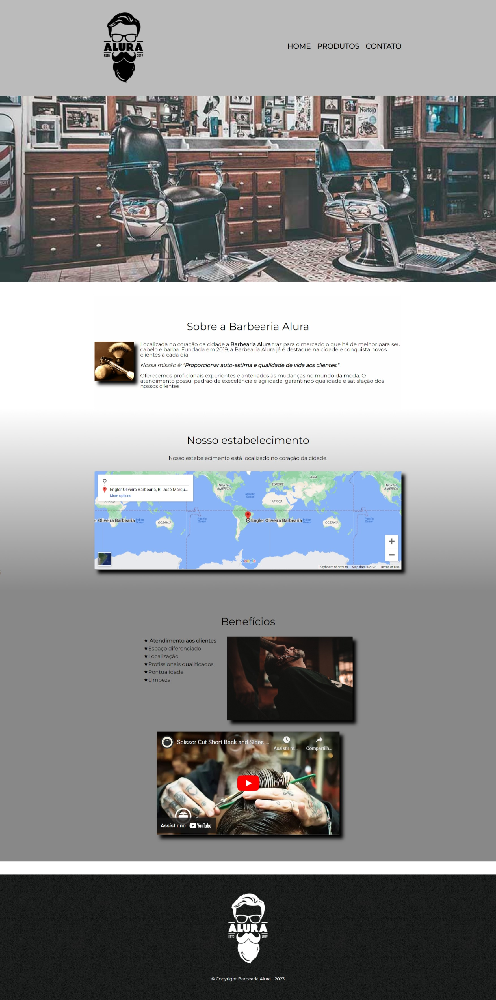
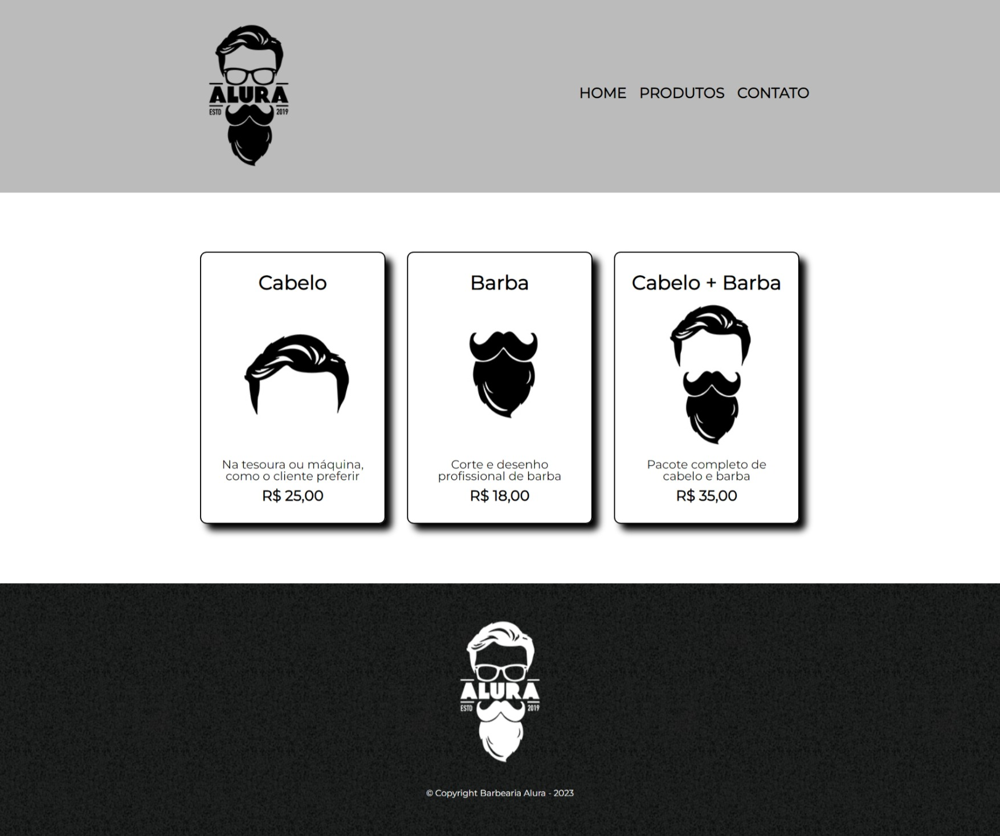
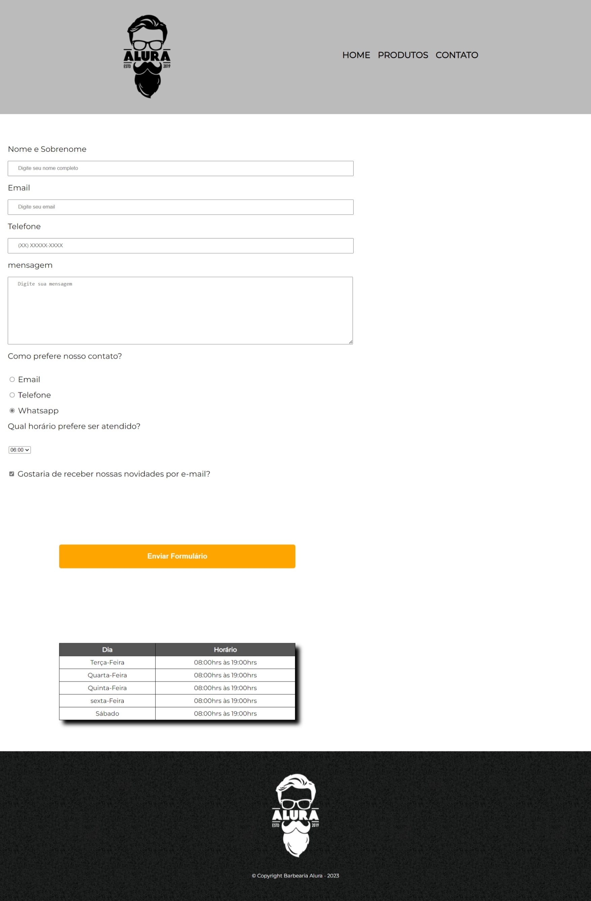

<h1 align="center"> Barbearia Alura</h1>

 Página do dashboard: 

---

 Página de Produtos:

---

 Página de Contatos: 

---

## 💻 Projeto:
Primeiro projeto desenvolvido durante o curso de HTML5 e CSS3 da Alura. 

Barbearia Alura é uma aplicação de um dasboard moderno para lançamento de produtos e cadatro de clientes, com uma home informando sobre a empresa..  

O proejto foi desenvolvido utilizando HTML5 e CSS3.

## 🚀 Tecnologias: 

  As seguintes ferramentas foram usadas no desenvolvimento dessa aplicação:
    <ul>
      <li><a href="https://www.alura.com.br/cursos-online-front-end/html-css?gclid=Cj0KCQiApKagBhC1ARIsAFc7Mc6SkEWZdBPFVv6LQJMeOqmkuWzFhLmPSK1VO-6wDc-4RbIKHOKdgoMaAneWEALw_wcB">HTML5</a></li>
      <li><a href="https://www.alura.com.br/cursos-online-front-end/html-css?gclid=Cj0KCQiApKagBhC1ARIsAFc7Mc6SkEWZdBPFVv6LQJMeOqmkuWzFhLmPSK1VO-6wDc-4RbIKHOKdgoMaAneWEALw_wcB">CSS3</a></li>
 

